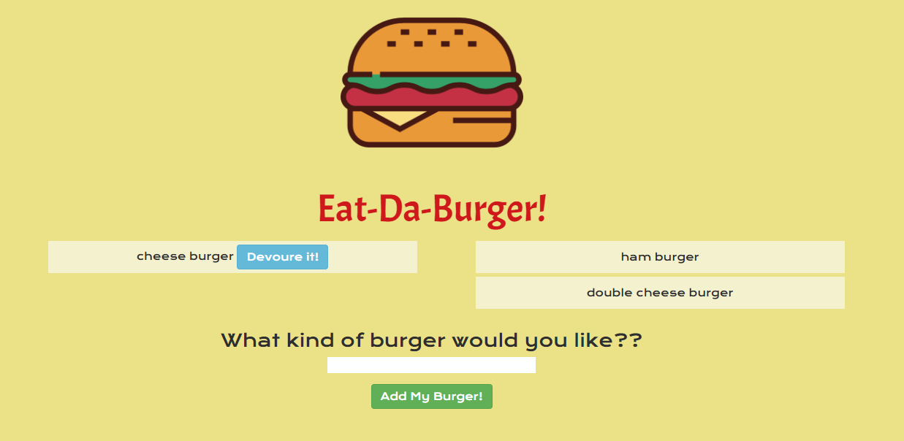

# Eat-Da-Burger! 
Full stack web app built with Bootstrap, Handlebars, Javascript, JQuery, Node, Express, and MySql.

## Overview
User can enter a burger name to add to a list and also adds it to the MySql database. 
The user can the "devoure it" by clicking the button, moving the burger to the right side of the screen and updating is status in the database.

## Heroku Demo
View demo here: 

